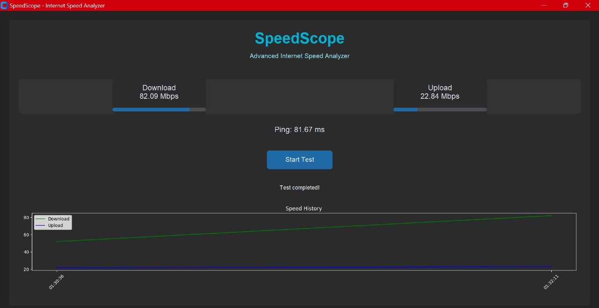

# SpeedScope - Internet Speed Analyzer


SpeedScope is a modern, user-friendly GUI application for testing and analyzing your internet connection speed. Built with Python and customtkinter, it provides real-time speed measurements, historical data tracking, and beautiful visualizations.



## Features

- 🚀 Real-time download and upload speed testing
- 📊 Interactive graphs showing speed history
- ⏱️ Ping measurement
- 📈 Progress bars with live updates
- 🌙 Modern dark theme interface
- 💾 Automatic test history saving
- 📱 Responsive design

## Installation

1. Clone the repository:
```bash
git clone https://github.com/your-username/speedscope.git
cd speedscope
```

2. Create a virtual environment (recommended):
```bash
python -m venv venv
# On Windows:
venv\Scripts\activate
# On macOS/Linux:
source venv/bin/activate
```

3. Install required packages:
```bash
pip install -r requirements.txt
```

## Usage

Run the application:
```bash
python speedscope.py
```

The application will:
1. Open a modern GUI interface
2. Allow you to start speed tests with a single click
3. Display real-time results with progress bars
4. Show historical data in a graph
5. Save all test results automatically

## Requirements

- Python 3.7 or higher
- Internet connection
- Required packages listed in `requirements.txt`

## Directory Structure

```
speedscope/
├── speedscope.py        # Main application file
├── requirements.txt     # Package dependencies
├── LICENSE             # MIT license
├── README.md          # This file
└── screenshots/       # Application screenshots
```

## Contributing

1. Fork the repository
2. Create your feature branch:
```bash
git checkout -b feature/AmazingFeature
```
3. Commit your changes:
```bash
git commit -m 'Add some AmazingFeature'
```
4. Push to the branch:
```bash
git push origin feature/AmazingFeature
```
5. Open a Pull Request

## Known Issues

- Progress bars might flicker on some systems during testing
- Some users may need to run as administrator for accurate speed tests

## Future Improvements

- [ ] Add export functionality for test history
- [ ] Implement server location selection
- [ ] Add more detailed network statistics
- [ ] Create system tray integration
- [ ] Add automatic scheduled testing

## License

This project is licensed under the MIT License - see the [LICENSE](LICENSE) file for details.

## Acknowledgments

- Built with [customtkinter](https://github.com/TomSchimansky/CustomTkinter)
- Speed testing powered by [speedtest-cli](https://github.com/sivel/speedtest-cli)
- Graphs created with [matplotlib](https://matplotlib.org/)

## Author

Tanish Poddar

Made with ❤️ by Tanish Poddar

---

If you find this project helpful, please consider giving it a star ⭐!